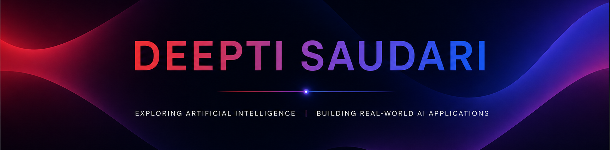

  

 

  

---

## 🥸 About Me

I'm a Computer Science graduate passionate about building software that combines **Artificial Intelligence** with practical engineering.

My primary interests include **Backend Engineering**, **Machine Learning**, **Large Language Models (LLMs)**, and **Intelligent Automation**. I enjoy designing scalable systems, integrating AI into real-world applications, and solving problems through clean, maintainable software.

I'm continuously learning modern AI technologies while strengthening my knowledge of software architecture, system design, and full-stack development.

---

## 🚀 What I'm Currently Working On

- 🤖 Building AI-powered applications using LLMs
- ⚙️ Learning Backend Engineering & System Design
- 🧠 Exploring Agentic AI & Multi-Agent Systems
- 📚 Improving Data Structures & Algorithms
- ☁️ Expanding Cloud & Software Architecture knowledge

---

## 🛠️ Tech Stack

### 💻 Programming Languages

---

### ⚙️ Backend Development

- FastAPI
- REST API Development
- API Integration
- System Design

---

### 🤖 Artificial Intelligence & Machine Learning

- Machine Learning
- Natural Language Processing (NLP)
- Prompt Engineering
- Large Language Models (LLMs)
- Multi-Agent Systems
- Retrieval-Augmented Generation (RAG)
- Google Gemini API
- Groq LLaMA

---

### 📚 Libraries & Frameworks

NumPy • Pandas • Scikit-learn • TensorFlow • Streamlit

---

### ☁️ Cloud & Tools

---
## 🚀 Featured Projects

### 🚀 AI Startup Co-Founder

AI-powered multi-agent platform that transforms startup ideas into validated business strategies through intelligent AI collaboration.

**Highlights**

- 🤖 13 specialized AI agents
- 📊 Automated market research & competitor analysis
- 💰 Financial planning and investment scoring
- 📈 Business Model Canvas & Lean Canvas generation
- 🎤 Investor-ready pitch generation

**Tech**

`Python` `FastAPI` `Next.js` `TypeScript` `Groq LLM`

🔗 Repository: https://github.com/Deepti-Saudari/agentic-ai-startup-cofounder

---

### 🎤 AI Mock Interview

AI-powered interview preparation platform that generates personalized interview questions and provides intelligent feedback using Generative AI.

**Highlights**

- 🤖 AI-generated interview questions
- 🎤 Speech-to-text integration
- 🧠 Gemini AI evaluation
- 📊 Performance analytics dashboard
- 📝 Interview history

**Tech**

`Python` `FastAPI` `Gemini AI` `Next.js` `Clerk`

🔗 Repository: https://github.com/Deepti-Saudari/AI-Mock-Interview

---

### 👗 Fashion Recommendation System

Computer vision application that recommends visually similar fashion products using deep feature extraction.

**Highlights**

- 🧠 ResNet-50 feature extraction
- 🔍 Image similarity search
- 👗 Content-based recommendation
- ⚡ Fast image retrieval
- 🌐 Streamlit application

**Tech**

`Python` `TensorFlow` `ResNet-50` `Streamlit`

🔗 Repository: https://github.com/Deepti-Saudari/FashionRecommendationSystem

---

## 📊 GitHub Analytics

---
## 🏆 Certifications

- 🎓 AI Agents and Agentic AI with Python & Generative AI
- ☁️ AWS Cloud Fundamentals
- 🤖 Machine Learning & Artificial Intelligence
- 💻 Python Programming
- 🌐 Full Stack Development

---

## 🌱 Currently Exploring

- Multi-Agent AI Systems
- Retrieval-Augmented Generation (RAG)
- Backend System Design
- Cloud Architecture
- Advanced FastAPI
- LLM Application Development

---

## 📚 Relevant Coursework

Operating Systems • Database Management Systems • Data Structures & Algorithms • Computer Networks • Object-Oriented Programming • Machine Learning • Artificial Intelligence • Cloud Computing

---

## 🤝 Let's Connect

---

### ⭐ Thanks for visiting my profile!

Building intelligent software, one project at a time.

